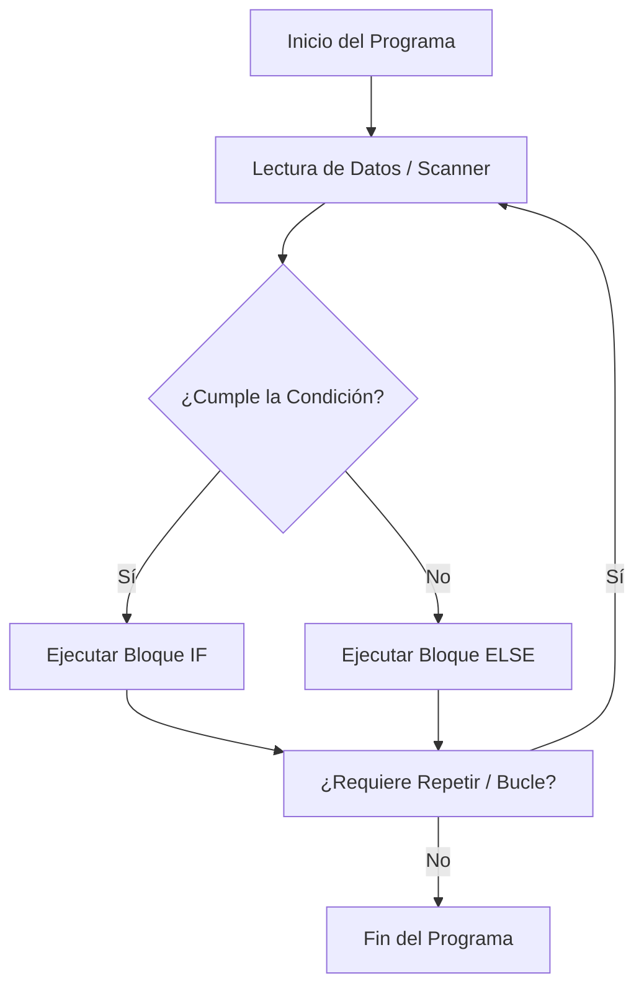

# 🧠 Módulo 01: Lógica de Programación

Este módulo abarca los fundamentos esenciales para dominar el flujo de ejecución en Java. Aquí documento las bases algorítmicas indispensables antes de estructurar sistemas complejos o interfaces gráficas.

---

## 🔑 Conceptos Clave

* **Algoritmo:** Secuencia ordenada y finita de pasos lógicos para resolver un problema.
* **Variable:** Espacio reservado en memoria con un tipo de dato específico para almacenar información mutable.
* **Estructura Secuencial:** Flujo por defecto donde las instrucciones se ejecutan línea por línea, de arriba hacia abajo.
* **Estructura Condicional:** Bifurcación en el camino del programa que evalúa una expresión booleana (`true`/`false`).
* **Bucle / Iteración:** Bloque de código que se repite de forma controlada mientras se cumpla una condición.

---

## 📊 Diagrama de Arquitectura (Flujo Lógico Estándar)

Este diagrama representa cómo se comporta el flujo de control típico en cualquier algoritmo de este módulo al evaluar datos:

---

## 📝 Resumen Técnico

Java es un lenguaje de **tipado estricto**, lo que significa que cada variable debe declarar su tipo (`int`, `double`, `boolean`) desde el inicio y este no puede cambiar. Para optimizar el rendimiento técnico en este módulo, aplicamos la evaluación de cortocircuito con los operadores `&&` y `||`, y gestionamos correctamente la memoria liberando el buffer del teclado mediante el método `scanner.close()`.

---

## 📖 Temario Detallado del Módulo

* [🔢 Variables y Operadores](./variables-operadores.md)
* [🔀 Estructuras Condicionales](./estructuras-control.md)
* [🔄 Bucles e Iteraciones](./bucles-iteraciones.md)
* [🧮 Estructuras de Datos Estáticas (Arrays)](./arreglos-estaticos.md)

---

## 💻 Código Práctico Relacionado
* [📂 Ir a los ejercicios de lógica en código](../../src/com/ejercicios/logica/)

---
## ↩️ Navegación
* [📚 Volver al Índice General de Teoría](../index.md)
* [🏠 Volver al Inicio del Sitio](../../index.md)
