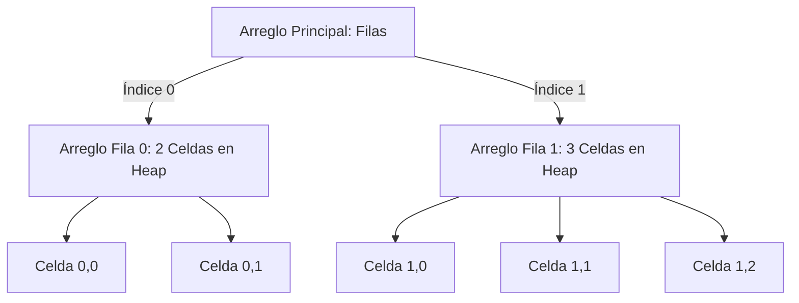

# 🗺️ Arreglos Multidimensionales: Matrices y Arreglos Irregulares (Jagged Arrays)

En Java, los arreglos multidimensionales reales no existen a nivel físico de hardware. Una matriz se implementa internamente bajo el concepto de **"un arreglo de arreglos"**.

## 🔑 Conceptos Clave y Fundamentos
* **Estructura Bidimensional (Matrices):** Se visualizan lógicamente como tablas compuestas por filas y columnas. Físicamente, es un arreglo principal donde cada una de sus celdas almacena una referencia que apunta a otro arreglo independiente en el Heap.
* **Arreglos Irregulares (Jagged Arrays):** Al ser cada fila un arreglo independiente, Java permite de forma nativa que **cada fila tenga una longitud o tamaño diferente**. Esto es sumamente útil para optimizar memoria RAM al representar datos asimétricos (como los días de cada mes del año).

## 📊 Arquitectura Física de una Matriz Irregular en Memoria
Representación estructural de una matriz donde la fila 0 tiene 2 columnas y la fila 1 tiene 3 columnas:



## 📝 Resumen Técnico y Rendimiento
* **Localidad de Datos:** Al recorrer matrices, la forma óptima de aprovechar la memoria caché del procesador (CPU Cache) es mediante el orden de **Fila Mayor** (recorrer todas las columnas de la fila actual antes de pasar a la siguiente). Hacerlo al revés (Columna Mayor) obliga a la JVM a saltar constantemente entre diferentes direcciones del Heap, provocando fallos de caché (*Cache Misses*) que ralentizan el software.

## 💻 Código Fuente de Nivel Avanzado
```java
package com.ejercicios.logica;

public class MatricesAvanzadas {
    public static void main(String[] args) {
        System.out.println("--- Construcción de un Arreglo Irregular (Jagged Array) ---");

        // Declaramos una matriz definiendo únicamente el número de filas (2 filas)
        int[][] matrizIrregular = new int[2][];

        // Definimos dinámicamente tamaños diferentes para cada fila en el Heap
        matrizIrregular[0] = new int[2]; // Fila 0 tiene 2 columnas
        matrizIrregular[1] = new int[4]; // Fila 1 tiene 4 columnas

        // Llenado de datos controlado
        matrizIrregular[0][1] = 99;
        matrizIrregular[1][3] = 500;

        // Recorrido anidado dinámico respetando el tamaño específico de cada fila
        for (int i = 0; i < matrizIrregular.length; i++) {
            for (int j = 0; j < matrizIrregular[i].length; j++) {
                System.out.print("[" + matrizIrregular[i][j] + "] ");
            }
            System.out.println(); // Salto de línea por cada fila terminada
        }
    }
}
```

---

## 💻 Enlaces del Ecosistema
* [📂 Ver Archivo de Código: Condicionales.java](../../src/com/ejercicios/logica/Matrices.java)
* [🧠 Volver al Índice del Módulo 01](./index.md)
