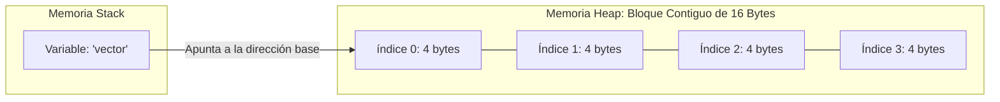

# 🧮 Arreglos Unidimensionales (Vectores) y Asignación de Memoria Contigua

Un arreglo unidimensional (o vector) es la estructura de datos estática más primitiva en Java. Modela una colección finita, homogénea y ordenada de elementos que se almacena en un bloque de memoria física contiguo asignado estrictamente durante el tiempo de ejecución inicial.

## 🔑 Conceptos Clave y Fundamentos
* **Homogeneidad de Datos:** Todos los elementos del arreglo deben compartir obligatoriamente el mismo tipo de dato exacto (ya sean primitivos como `int` o tipos referencia como objetos `String`).
* **Punteros y Direccionamiento Físico:** En Java, la variable que representa al arreglo no almacena los datos directamente; almacena una **referencia** (dirección de memoria) que apunta al primer elemento del bloque (índice 0). 
* **Acceso Instantáneo $O(1)$:** Para leer o escribir en cualquier posición, la Máquina Virtual de Java (JVM) no recorre el arreglo. Utiliza una fórmula matemática de desplazamiento directo:
  $$\text{Dirección del Índice } i = \text{Dirección Base} + (i \times \text{Tamaño del Tipo de Dato en Bytes})$$
  Esto significa que acceder a la posición 0 o a la posición 1,000,000 toma exactamente el mismo tiempo de procesamiento de hardware.

## 📊 Representación Interna en la Memoria RAM
Cuando declaras `int[] vector = new int[4];`, la JVM reserva bloques contiguos de 4 bytes (tamaño nativo del tipo `int`):



## 📝 Resumen Técnico y Casos de Borde
* **Inmutabilidad Absoluta:** La propiedad `.length` de un arreglo es un valor de solo lectura (`public final int`) definido en la instanciación. No existe ningún método nativo para alterar su capacidad.
* **El Peligro del Desbordamiento:** Si intentas evaluar o asignar un índice fuera del rango definido ($i < 0$ o $i \ge \text{length}$), la JVM detendrá el hilo de ejecución arrojando la excepción desmarcada `ArrayIndexOutOfBoundsException`.

## 💻 Código Fuente de Nivel Avanzado
```java
package com.ejercicios.logica;

public class VectoresAvanzados {
    public static void main(String[] args) {
        // Inicialización explícita con valores por defecto automáticos (en int se inicializan en 0)
        int[] lecturasSensores = new int[5];
        
        // Asignación directa O(1)
        lecturasSensores[0] = 45;
        lecturasSensores[1] = 89;
        
        System.out.println("--- Recorrido Indexado Eficiente ---");
        // Optimizamos guardando el tamaño en una variable local para evitar llamados repetitivos a la propiedad en el bucle
        int limite = lecturasSensores.length;
        for (int i = 0; i < limite; i++) {
            System.out.println("Sensor [" + i + "] = " + lecturasSensores[i]);
        }

        // Caso de Borde: For-Each (Sintaxis simplificada, no permite modificar los valores del arreglo, solo leerlos)
        System.out.println("\n--- Recorrido For-Each (Solo Lectura) ---");
        for (int lectura : lecturasSensores) {
            System.out.println("Valor: " + lectura);
        }
    }
}
```

---

## 💻 Enlaces del Ecosistema
* [📂 Ver Archivo de Código: Condicionales.java](../../src/com/ejercicios/logica/arrays.java)
* [🧠 Volver al Índice del Módulo 01](./index.md)
