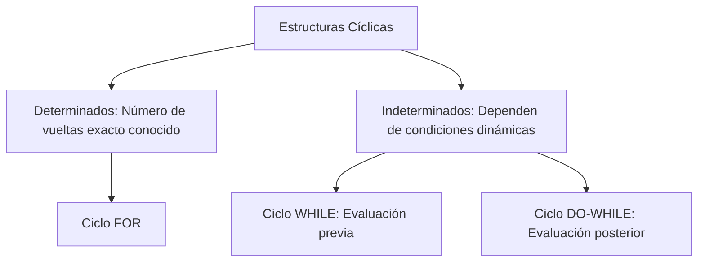

# 🔄 Bucles, Ciclos Iterativos y Control de Saltos en Java

Los bucles gestionan la repetición de tareas computacionales. Un algoritmo mal diseñado en sus ciclos puede provocar un bucle infinito que sature la CPU al 100% o desencadenar fugas de procesamiento por evaluaciones ineficientes.

---

## 1. Clasificación Técnica de Bucles: Determinados vs Indeterminados

En Java, los bucles se dividen rigurosamente bajo el criterio de predictibilidad de sus vueltas de ciclo en el hilo de ejecución.



### Ciclo `for` (Determinado por excelencia)
Estructura optimizada para recorrer arreglos o colecciones indexadas. Su declaración agrupa la inicialización, la condición de parada y la expresión de incremento en una sola línea atómica.

```java
// Estructura interna de un ciclo de conteo estándar
for (int i = 0; i < 10; i++) {
    System.out.println("Índice actual de CPU: " + i);
}
```

### Ciclo `while` vs `do-while` (La garantía de primera ejecución)
* **`while`:** Evalúa primero la condición. Si esta es falsa desde el principio, el bloque interno **nunca** se ejecuta.
* **`do-while`:** Ejecuta el bloque interno **primero** y luego evalúa la condición de parada. Esto garantiza que el código se ejecute **al menos una vez**, lo cual es ideal para pintar menús de consola interactivos.

```java
// Ejemplo de menú con garantía de ejecución
int opcion;
do {
    imprimirMenu();
    opcion = scanner.nextInt();
} while (opcion != 4); // El ciclo sigue hasta que el usuario digita 4
```

---

## 2. Sentencias de Interrupción de Flujo: `break` y `continue`

Java dispone de dos palabras clave de control de saltos capaces de alterar el comportamiento nativo de cualquier ciclo iterativo en tiempo de ejecución.

### `break` (Ruptura Absoluta)
Detiene la ejecución del bucle por completo de manera inmediata. El puntero del programa salta a la siguiente instrucción fuera del bloque del ciclo. Se usa habitualmente en algoritmos de búsqueda para ahorrar ciclos de reloj una vez hallado el dato.

```java
String[] nombres = {"Juan", "Ana", "Carlos", "Sofía"};
for (String nombre : nombres) {
    if (nombre.equals("Carlos")) {
        System.out.println("Encontrado.");
        break; // Detiene el bucle por completo. No evalúa a Sofía.
    }
}
```

### `continue` (Salto Intermedio)
No rompe el bucle; simplemente interrumpe la iteración actual en esa línea exacta y salta directo a la cabecera del ciclo para evaluar la siguiente vuelta. Es ideal para saltar elementos no válidos en procesos de filtrado.

```java
// Imprimir solo números impares saltando los pares
for (int i = 1; i <= 10; i++) {
    if (i % 2 == 0) {
        continue; // Ignora las líneas de abajo y pasa al siguiente número
    }
    System.out.println("Número Impar: " + i);
}
```

---

## 💻 Enlaces del Ecosistema
* [📂 Ir al Código Fuente de Lógica](../../src/com/ejercicios/logica/)
* [🧠 Volver al Índice del Módulo 01](./index.md)
