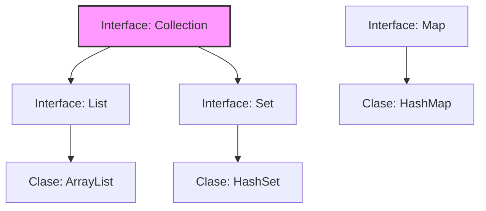

# 📊 Módulo 02: Estructuras de Datos (Collections Framework)

Este módulo cubre el estudio en profundidad del ecosistema de colecciones dinámicas de Java, analizando su comportamiento en memoria, contratos de asignación y rendimiento algorítmico.

---

## 🔑 Conceptos Clave del Módulo

* **Estructuras Dinámicas:** Colecciones capaces de mutar su tamaño en tiempo de ejecución.
* **Mecánica de Hashing:** Uso de algoritmos de dispersión matemática para indexar datos de forma inmediata.
* **Integridad de Datos:** Mecanismos nativos para erradicar registros duplicados en sistemas de información.

---

## 📊 Mapa Arquitectónico de Tipos

---

## 📖 Temario Desglosado del Módulo

Selecciona un tema para estudiar sus fundamentos técnicos y matemáticos:

### 1. 📦 [Listas Dinámicas e Indexación](./listas-dinamicas.md)
* Análisis interno de la clase `ArrayList` y factor de redimensión en el Heap.
* Complejidades temporales Big O para operaciones de lectura, inserción y borrado.

### 2. 🛡️ [Conjuntos y Tablas Hash](./conjuntos-unicidad.md)
* Implementación de `HashSet` y control estricto de unicidad sin duplicados.
* Contrato técnico y matemático entre los métodos `equals()` y `hashCode()`.

### 3. 🗺️ [Mapas y Estructuras Asociativas](./mapas-diccionarios.md)
* Gestión de diccionarios de datos mediante pares de Llave-Valor con `HashMap`.
* Factor de carga, procesos de Re-hashing e iteración óptima con EntrySet.

---

## 💻 Código Práctico de Referencia
* [📂 Ver archivo de código fuente: `GestionColecciones.java`](../../src/com/ejercicios/estructuras/GestionColecciones.java)

---

## ↩️ Navegación
* [📚 Volver al Índice General de Teoría](../index.md)
* [🏠 Volver al Inicio del Repositorio](../../index.md)
