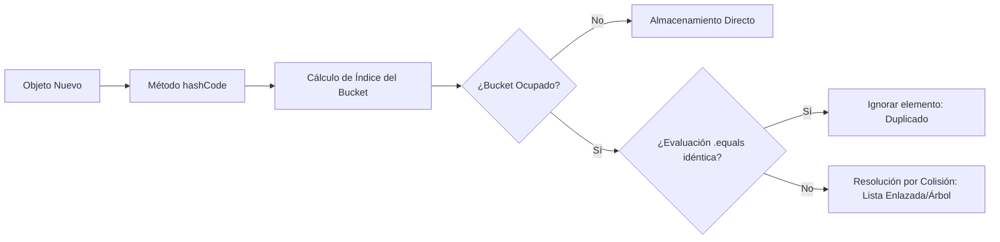

# 🛡️ Conjuntos y Unicidad de Datos (`Set` y `HashSet`)

La interfaz `java.util.Set` modela la abstracción matemática de un conjunto. Se caracteriza de forma estricta por prohibir la existencia de elementos duplicados dentro de la colección.

## 🔑 Conceptos Clave y Fundamentos
* **Tabla Hash (Hashing):** `HashSet` utiliza un mapa interno (`HashMap`) para almacenar sus elementos. Cuando agregas un valor al conjunto, se guarda internamente como la *Llave* de ese mapa, asignándole un objeto *Dummy* estático como valor constante asociado.
* **Función Hash:** Para determinar si un objeto ya existe sin recorrer toda la lista, Java evalúa el método `hashCode()`. Este método procesa el contenido del objeto y devuelve un entero de 32 bits que determina el "Casillero" (*Bucket*) de memoria donde debe guardarse.
* **Contrato `equals()` y `hashCode()`:** Si dos objetos son idénticos según el método `equals()`, obligatoriamente deben retornar el mismo valor entero desde `hashCode()`. Si rompes esta regla técnica, el `HashSet` permitirá almacenar duplicados silenciosos, rompiendo la integridad del sistema.

## 📊 Resolución de Colisiones en Tabla Hash


## 📝 Resumen Técnico e Impacto en Rendimiento
* **Inserción, Búsqueda y Eliminación:** Complejidad media de $O(1)$. Al no requerir bucles de escaneo para buscar elementos, las operaciones se ejecutan de manera inmediata calculando su Hash.
* **Peor Escenario (Worst Case):** Si la función `hashCode()` está mal programada y devuelve siempre el mismo número, todos los datos colisionarán en el mismo casillero. Esto degrada el rendimiento de la estructura de $O(1)$ a un comportamiento lineal $O(n)$ o logarítmico $O(\log n)$.

## 💻 Código Fuente Avanzado con Casos de Borde
```java
package com.ejercicios.estructuras;

import java.util.HashSet;
import java.util.Set;

// Record para asegurar inmutabilidad y autogeneración perfecta de equals() y hashCode()
record Usuario(String cedula, String nombre) {}

public class EjemploConjuntos {
    public static void main(String[] args) {
        Set<Usuario> registroUnico = new HashSet<>();

        Usuario u1 = new Usuario("V-12345", "Carlos Pérez");
        Usuario u2 = new Usuario("V-12345", "Carlos Pérez"); // Duplicado lógico

        registroUnico.add(u1);
        boolean insertado = registroUnico.add(u2); // Retornará false de manera nativa

        System.out.println("¿Se insertó el segundo usuario?: " + insertado);
        System.out.println("Tamaño total del Set (Debe ser 1): " + registroUnico.size());
    }
}
```

---

## ↩️ Navegación del Ecosistema
* [📊 Volver al Índice del Módulo 02](./index.md)
* [📚 Volver al Índice General de Teoría](../index.md)
* [💻 Ver Código Práctico Asociado](../../src/com/ejercicios/estructuras/GestionColecciones.java)
