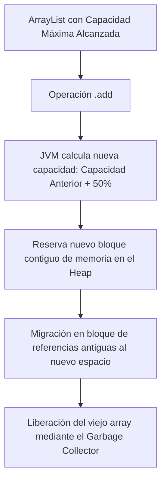

# 📦 Listas Dinámicas en Java (`List` e `ArrayList`)

La interfaz `java.util.List` representa una colección ordenada por secuencia de elementos que permite duplicados y un acceso posicional preciso mediante un índice entero basado en cero.

## 🔑 Conceptos Clave y Fundamentos
* **Arreglo Dinámico:** A diferencia de los arrays nativos (`T[]`) cuyo tamaño es inmutable, un `ArrayList` encapsula un arreglo interno que se redimensiona automáticamente cuando su capacidad máxima se ve comprometida.
* **Factor de Redimensión (Capacity Growth):** Cuando un `ArrayList` se llena, la JVM calcula un nuevo tamaño aumentando la capacidad actual en un 50% mediante un operador de desplazamiento de bits a la derecha (`oldCapacity + (oldCapacity >> 1)`), crea un nuevo array en el Heap y clona los elementos del viejo array hacia el nuevo mediante `System.arraycopy`.
* **Acceso Aleatorio Constante:** Al implementar la interfaz Marcadora `RandomAccess`, permite recuperar cualquier elemento por su índice en tiempo constante $O(1)$.

## 📊 Mecánica Interna de Redimensión


## 📝 Resumen Técnico y Complejidad Algorítmica (Big O)
* **Lectura (`get(index)`):** Complejidad $O(1)$. Acceso directo instantáneo por cálculo matemático de desplazamiento de dirección de memoria.
* **Inserción al Final (`add(element)`):** Complejidad $O(1)$ amortizado. Es instantáneo a menos que se dispare el factor de redimensión, transformándolo temporalmente en $O(n)$.
* **Inserción/Eliminación Intermedia (`add(index, element)` / `remove(index)`):** Complejidad $O(n)$. Requiere desplazar en bloque todos los elementos subsiguientes una posición hacia la derecha o hacia la izquierda en la memoria RAM.

## 💻 Código Fuente Avanzado con Casos de Borde
```java
package com.ejercicios.estructuras;

import java.util.ArrayList;
import java.util.List;

public class EjemploListas {
    public static void main(String[] args) {
        // Inicialización optimizada especificando la capacidad inicial para evitar mutaciones de memoria
        List<String> frameworkList = new ArrayList<>(20);
        
        frameworkList.add("Spring Boot");
        frameworkList.add("Jakarta EE");
        frameworkList.add("Hibernate");
        frameworkList.add("Spring Boot"); // Permite duplicación explícita

        // Modificación posicional intermedia (Dispara un desplazamiento O(n) interno)
        frameworkList.add(1, "Quarkus");

        // Iteración Fail-Fast: Si modificas la lista estructuralmente mientras la iteras, lanzará ConcurrentModificationException
        System.out.println("--- Iteración de Lista Dinámica ---");
        for (String fw : frameworkList) {
            System.out.println("Framework: " + fw);
        }
    }
}
```

---

## ↩️ Navegación del Ecosistema
* [📊 Volver al Índice del Módulo 02](./index.md)
* [📚 Volver al Índice General de Teoría](../index.md)
* [💻 Ver Código Práctico Asociado](../../src/com/ejercicios/estructuras/GestionColecciones.java)
