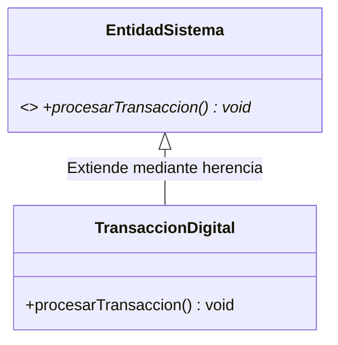

# 📦 Módulo 03: Programación Orientada a Objetos (POO)

Este módulo profundiza en el paradigma central de Java. Analiza cómo modelar sistemas de software modulares, seguros y altamente extensibles mediante entidades lógicas y la gestión de objetos dinámicos en la memoria.

---

## 🔑 Conceptos Clave del Módulo

* **Entidades Dinámicas:** Control de ciclo de vida de instancias asignadas en el espacio del Heap.
* **Encapsulamiento Rígido:** Blindaje del estado interno de los componentes mediante modificadores de acceso.
* **Enlace Dinámico:** Resolución en tiempo de ejecución de comportamientos especializados basados en polimorfismo.

---

## 📊 Jerarquía Polimórfica del Módulo

---

## 📖 Temario Desglosado del Módulo

Selecciona un tema para estudiar sus fundamentos arquitectónicos:

### 1. 🏗️ [Clases, Objetos y Memoria Heap](./clases-objetos.md)
El plano conceptual de las clases frente al espacio contiguo de memoria de los objetos y el Garbage Collector.

### 2. 🛡️ [Abstracción y Encapsulamiento Avanzado](./abstraccion-encapsulamiento.md)
Matriz de visibilidad de los modificadores de acceso y técnicas preventivas contra la Fuga de Referencias.

### 3. 🧬 [Herencia, Polimorfismo y Enlace Dinámico](./herencia-polimorfismo.md)
Extensibilidad de software por jerarquía de tipos, el uso de `@Override` y el funcionamiento interno de la Tabla de Métodos Virtuales.

---

## 💻 Código Práctico de Referencia
* [📂 Ver archivo de código fuente: `GestionMapeoPOO.java`](../../src/com/ejercicios/poo/GestionMapeoPOO.java)

---

## ↩️ Navegación del Ecosistema
* [📚 Volver al Índice General de Teoría](../index.md)
* [🏠 Volver al Inicio del Repositorio](../../index.md)
