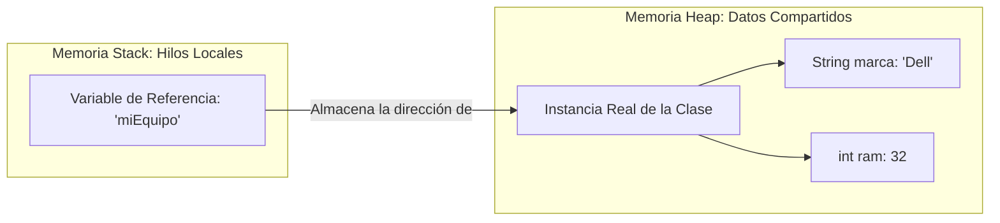

# 🏗️ Clases, Objetos y Gestión Dinámica de Memoria Heap

La Programación Orientada a Objetos (POO) organiza el desarrollo de software estructurando datos y comportamientos en bloques reutilizables, gestionando estrictamente su ciclo de vida en el hardware.

## 🔑 Conceptos Clave y Fundamentos
* **La Clase como Meta-Estructura:** Es la plantilla técnica cargada estáticamente por el *ClassLoader* de la JVM en el área de métodos. Define cuántos bytes requerirá una instancia en ejecución.
* **El Objeto en el Heap:** Es el bloque contiguo de memoria física reservado dinámicamente en tiempo de ejecución. Los objetos viven de forma exclusiva en la zona compartida llamada **Heap**.
* **El Puntero `this`:** Es una referencia autogenerada de solo lectura implícita que almacena la dirección de memoria exacta del objeto que se encuentra ejecutando el método actual.

## 📊 Distribución Física en Memoria RAM

## 📝 Resumen Técnico del Ciclo de Vida
1. **Instanciación (`new`):** La palabra clave `new` solicita a la JVM reservar espacio en el Heap.
2. **Inicialización:** Se invoca el constructor correspondiente para setear los atributos de instancia.
3. **Recolección de Basura:** Cuando un objeto pierde todas sus referencias en el Stack (queda huérfano), se vuelve candidato para ser destruido automáticamente por el **Garbage Collector**, liberando la memoria.

---

## ↩️ Navegación del Ecosistema
* [📊 Volver al Índice del Módulo 03](./index.md)
* [📚 Volver al Índice General de Teoría](../index.md)
* [💻 Ver Código Práctico Asociado](../../src/com/ejercicios/poo/GestionMapeoPOO.java)
