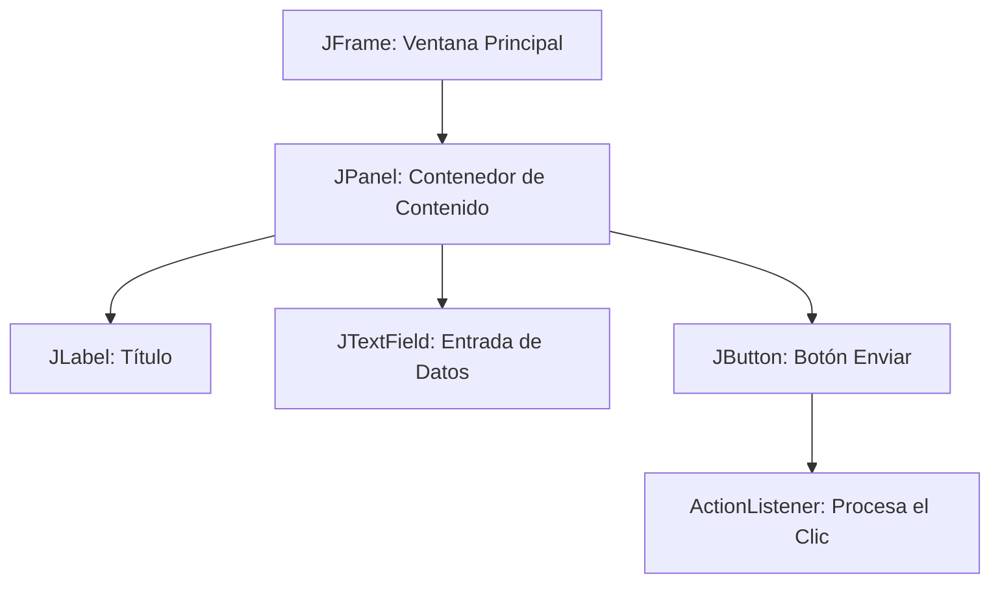

# 🖼️ Módulo 03: Interfaces Gráficas de Usuario (IGU)

Aquí documentamos cómo construir aplicaciones de escritorio visuales e interactivas utilizando la librería nativa **Java Swing**.

---

## 🔑 Conceptos Clave

* **JFrame:** La ventana principal o contenedor raíz de la aplicación.
* **JPanel:** Un contenedor secundario utilizado para agrupar y organizar componentes (como un lienzo intermedio).
* **Componentes (JComponents):** Elementos visuales interactivos como `JButton` (botones), `JTextField` (campos de texto) y `JLabel` (etiquetas de texto/imágenes).
* **Event Listeners (Oyentes):** Interfaces que "escuchan" las acciones del usuario (un clic, una tecla presionada) y disparan un bloque de código en respuesta.

---

## 📊 Diagrama de Arquitectura (Jerarquía Visual)

Jerarquía estándar de cómo se anidan los componentes gráficos en una interfaz de Java:

---

## 📝 Resumen Técnico

Swing no tiene hilos de ejecución completamente seguros (Not Thread-Safe). Por norma técnica, todas las interfaces gráficas deben inicializarse y ejecutarse dentro del hilo especial de despacho de eventos utilizando `SwingUtilities.invokeLater()`. Esto previene congelamientos y comportamientos erráticos en la pantalla.

---

## 📖 Temario Detallado del Módulo

Selecciona un tema para ver los apuntes teóricos detallados:

### 1. 🪟 [Contenedores y Ventanas](./contenedores-ventanas.md)
* Configuración del contenedor raíz: `JFrame`.
* Organización del espacio de trabajo con paneles: `JPanel`.
* Ciclo de vida y cierre de una ventana de escritorio.

### 2. 🕹️ [Componentes Visuales y Eventos](./componentes-eventos.md)
* Implementación de botones (`JButton`), textos (`JTextField`) y etiquetas (`JLabel`).
* Captura de acciones del usuario mediante `ActionListener`.
* Manejo del hilo de despacho de eventos (*Event Dispatch Thread*).

### 3. 📐 [Gestores de Diseño (Layouts)](./gestores-diseno.md)
* Distribución automática de elementos con `BorderLayout` y `GridLayout`.
* Uso avanzado de `FlowLayout` y posicionamiento libre.
* Creación de interfaces gráficas adaptables a diferentes resoluciones de pantalla.

---

## 💻 Código Práctico Relacionado
* [📂 Explorar archivos de interfaz gráfica](../../src/com/ejercicios/igu/)

---
## ↩️ Navegación
* [📚 Volver al Índice General](../index.md)
