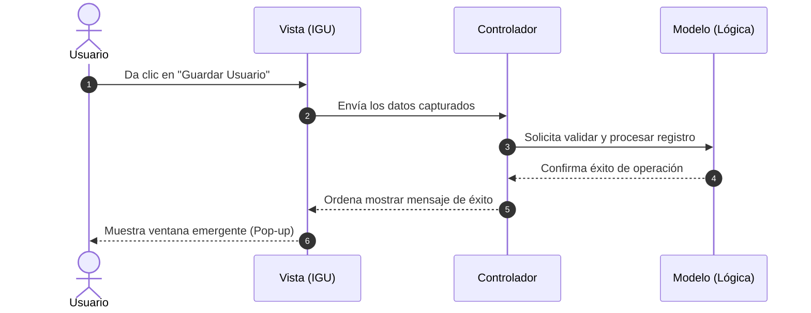

# 🛠️ Módulo 04: Arquitectura y Proyectos

En esta etapa final, integramos la lógica pura, la persistencia de datos y las interfaces gráficas bajo patrones de diseño profesionales utilizados en la industria.

---

## 🔑 Conceptos Clave

* **Arquitectura en Capas:** Separación drástica de responsabilidades para que el código sea escalable y fácil de mantener.
* **Patrón MVC (Modelo-Vista-Controlador):**
  * **Modelo (Model):** Representa los datos y las reglas del negocio (Clases de lógica).
  * **Vista (View):** La pantalla que ve el usuario (IGU).
  * **Controlador (Controller):** El intermediario que recibe las acciones de la Vista y actualiza el Modelo.

---

## 📊 Diagrama de Arquitectura (Flujo MVC)

Así fluyen los datos y el control cuando un usuario interactúa con un proyecto estructurado:

---

## 📝 Resumen Técnico

La ventaja crítica de desacoplar los proyectos en MVC es que si mañana decides cambiar la interfaz gráfica (por ejemplo, pasar de Swing a una aplicación web), el 100% de tu código de lógica (el Modelo) se mantendrá intacto. Solo tendrás que sustituir la capa de la Vista.

---

## 📖 Temario Detallado del Módulo

Selecciona un tema para ver los apuntes teóricos detallados:

### 1. 🧱 [Arquitectura en Capas](./arquitectura-capas.md)
* Principio de responsabilidad única aplicado al software.
* Separación estricta entre la lógica de negocio y la interfaz de usuario.
* Flujo de comunicación interna entre clases de distintas carpetas.

### 2. 🗺️ [Patrón de Diseño MVC](./patron-mvc.md)
* El rol del Modelo (Datos), la Vista (Pantallas) y el Controlador (Intermediario).
* Desacoplamiento total para facilitar el mantenimiento y la escalabilidad del sistema.
* Creación de un proyecto base desde cero aplicando MVC.

### 3. 💾 [Persistencia de Datos Básica](./persistencia-datos.md)
* Introducción al almacenamiento persistente.
* Lectura y escritura de archivos planos en el disco duro (`.txt`).
* Preparación del sistema para futuras conexiones a bases de datos relacionales.

---

## 💻 Código Práctico Relacionado
* [📂 Explorar mini-proyectos integrados](../../src/com/ejercicios/proyectos/)

---
## ↩️ Navegación
* [📚 Volver al Índice General](../index.md)
