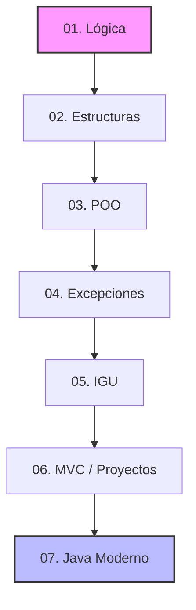

# 📚 Índice General de Teoría

Bienvenido a la sección teórica de mi bitácora de aprendizaje. Aquí encontrarás los fundamentos conceptuales de Java, organizados por módulos de aprendizaje que van desde las bases hasta la arquitectura de proyectos.

---
## 🗺️ Mapa de Ruta del Contenido

1. **[Módulo 01: Lógica de Programación](./teoria/01-logica/index.md)** 🧠  
   *Fundamentos, estructuras de control, operadores y algoritmos en consola.*
2. **[Módulo 02: Estructuras de Datos](./teoria/02-estructuras/index.md)** 📊  
   *Colecciones dinámicas, listas, mapas y conjuntos de datos en memoria.*
3. **[Módulo 03: Programación Orientada a Objetos (POO)](./teoria/03-poo/index.md)** 📦  
   *Clases, objetos, herencia, polimorfismo y diseño modular.*
4. **[Módulo 04: Gestión de Excepciones](./teoria/04-excepciones/index.md)** 🛡️  
   *Control estricto de errores con try-catch y robustez de software.*
5. **[Módulo 05: Interfaces Gráficas (IGU)](./teoria/05-igu/index.md)** 🖼️  
   *Ventanas, componentes visuales de Swing y gestión de eventos.*
6. **[Módulo 06: Arquitectura y Proyectos](./teoria/06-proyectos/index.md)** 🛠️  
   *Integración de sistemas completos bajo el patrón de diseño MVC y persistencia.*
7. **[Módulo 07: Java Moderno y Avanzado](./teoria/07-java-moderno/index.md)** ⚡  
   *API de Streams, Expresiones Lambda, Records y refactorización funcional.*

---
## 📊 Flujo General de Aprendizaje

El siguiente diagrama técnico muestra cómo cada módulo construye los cimientos para el siguiente, consolidando un aprendizaje iterativo:

---

## 🛠️ Recursos Útiles
* [Ir al Código Fuente del Proyecto](../src/com/ejercicios/)
* [Volver al Inicio Principal del Sitio](../index.md)
